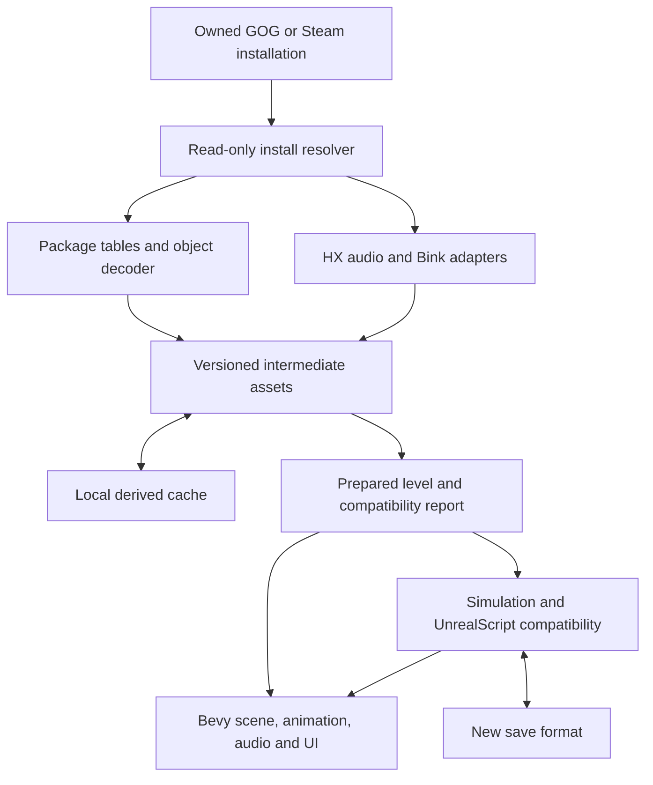

# Design: an installation-driven XIII runtime

Status: proposed architecture, grounded in the investigation. None of the runtime interfaces below are implemented yet.

## Product contract

A player selects an existing XIII Classic installation, or accepts an automatically discovered one. The application verifies a supported content profile, imports the required data, and starts the new runtime. It shows useful progress on first launch and reuses a local cache afterward. The installation is opened read-only. No editor, manual Blender export, original executable, Steam process or online account should be required by the new runtime merely to load supported local assets.

Ship independently implemented code and permitted dependencies. Read original assets and scripts from the player's installation. Store derived content and saves outside it. Successful asset reading does not confer permission to distribute those assets; this design keeps them out of the distributable.

Initial delivery target: native Windows x86-64. WSL/Linux is initially a development and headless-test target. Faithful single-player behavior is the default sequencing assumption. Online multiplayer, original network-protocol compatibility, original save-file compatibility, an editor and the 2020 remake are outside the first playable milestone.

## Main flow



There is a separate research path from a disposable original-game copy to screenshots, event traces and tool exports. Those outputs validate the direct importer. They are not a player installation prerequisite or a replacement for the direct importer.

## Module boundaries

Start with three crates: a pure package-reader library, a CLI inspector/import tool, and the Bevy application. Split the following modules into additional crates only when their interfaces justify it.

| Module | Responsibility | Must not depend on |
|---|---|---|
| `install` | Select root, recognize layout/profile, resolve names and package precedence | Bevy renderer, gameplay |
| `package` | Bounded archive reads, versioned tables, object identities and properties | Filesystem discovery, ECS, GPU |
| `decode` | Textures, models, BSP, terrain, animation, audio references, script metadata | Running game state |
| `asset_ir` | Typed normalized assets and provenance | Original memory pointers or GPU objects |
| `cache` | Content keys, atomic persistence, corruption recovery | Gameplay rules |
| `script` | Values, class/state/function semantics, bytecode/IR, native dispatch | Graphics devices or arbitrary OS access |
| `simulation` | Movement, collision, lifecycle, AI primitives, combat, checkpoints | Render frame rate |
| `presentation` | Scene realization, comic materials/cameras, UI, audio/video | Raw package offsets |
| `app` | Loading, menus, settings, save selection, diagnostics | Hidden parsing shortcuts |

The parser receives bytes and explicit limits. Disk access belongs to the install/cache layer. Headless tools and the renderer use the same decoded products. Never build separate “viewer” and “game” parsers that gradually diverge.

## Installation resolution

1. Honor an explicit chosen directory first; persist the choice in the new runtime's settings.
2. Optionally discover Steam libraries and app 1170760; find GOG candidates through bounded known locations/registry metadata. Validate content, not a folder's display name. Do not hardcode this user's drive letters.
3. Inventory actual filenames and supported package headers. Identify GOG platform-subdirectory and patched/flattened layouts. Detect `*Plus` and other extra packages as profile information.
4. Create a case-insensitive logical index while retaining exact filesystem paths. Handle `System/PC`, `TexturesPC`, `Textures`, `Maps`, `Maps/BaseSP` and `Maps/BaseMP` explicitly.
5. Resolve a logical package to one selected file. If there are conflicting candidates, report them or apply an explicitly documented, tested profile rule. Alphabetical order is not precedence. A GOG `SpecificPackage` entry is evidence to investigate original precedence, not permission to assume all subdirectory files override all others.
6. Parse only needed configuration fields. Do not execute original launch commands, load DLLs or adopt old network endpoints from configuration.
7. Walk level imports and class dependencies. Retain aliases/cycles through stable IDs, and give missing-package/object diagnostics with source provenance.

The same package basename in two selected roots must not silently mix editions. Select one installation per session. A patched copy may share base content with GOG while still having different script/UI behavior. Recognize this as a separate compatibility profile; do not advertise full patch support just because its headers parse.

## Package and object reader

Initial dialects: measured `(100, 50)`, `(100, 56)`, `(100, 57)`, `(100, 58)`. This is a supported test corpus, not a claim that all their object layouts are identical.

Implement checked little-endian reads and the old Unreal compact-index encoding; do not substitute LEB128. Store name IDs, signed import/export references, object flags and raw byte ranges explicitly. Parse GUID/generation metadata before relying on it for identity. The research probe currently validates only the basic summary and tables.

Use two passes: allocate identities and class relationships first, then decode references/properties/payloads. Import/export graphs can be cyclic. Defaults require class inheritance and serialized property overrides; zero-sized native class exports must be handled deliberately. Preserve unknown property tags and their bounded spans for diagnostics; do not guess their meaning.

Every class serializer must account for its export boundary. A successfully read prefix is not a successfully decoded mesh. Unknown tails should be reported with class, package revision and offsets, and promoted to understood layout only after evidence. Limit counts, allocation size, nesting, graph traversal and decode work before allocating. A valid header does not make arbitrary content trustworthy.

Suggested error context:

```text
installation profile / package hash / object path / export number
package version / absolute offset / payload-relative offset / expected type
unsupported feature or invalid bound / dependency chain
```

## Normalized assets and cache

Use stable `AssetId` values based on logical package/object identity and source provenance; include source content hashes in cache identity. Use a separate generational `ActorId` for runtime objects. Neither raw Bevy `Entity` values nor original memory addresses belong in saves or long-lived asset references.

The intermediate representation should cover:

- Textures: dimensions, mip chain, palette/compression interpretation, color space and alpha semantics.
- Materials: source material graph, blend/cutout flags, UV transforms, vertex color, lighting and comic-rendering requirements.
- Static geometry: vertices/indices/material sections, normals, UV channels, bounds and source transforms.
- World: BSP surfaces, visibility/zone information when decoded, terrain layers/holes, actor instances, level settings and collision as distinct products.
- Characters: skeleton hierarchy, bind transforms, skin weights, material slots, animation curves/tracks, named sequences, root motion and notifies.
- Scripts: reflected class/default metadata, function/state records, verified bytecode or internal instructions, and an explicit native dependency catalog.
- Audio: stable bank/sound identifiers, decoded or streamable content, channel layout, loops, cues and event mapping.

Cache key inputs: source file hashes for the complete consumed dependency set, import profile, importer version, serializer/IR schema, conversion settings and decoder version. Hash file content for correctness; size/mtime may be an optimization hint, not sole identity. A changed texture dependency must invalidate its derived material without unnecessarily reimporting unrelated maps.

Write temporary cache entries and atomically publish after validation. Reject truncated/corrupt entries and recompute. Cancellation must not publish incomplete products. Store under `%LOCALAPPDATA%\XIIIReborn\cache` by default on Windows; use an appropriate user cache directory on other targets. `XIIIReborn` is a working internal name, not a selected release brand. Permit an explicit cache directory and a clear-cache action.

Loading states: discovering → indexing → resolving → decoding → preparing → uploading → ready. A prepared CPU level is not necessarily GPU/audio-ready. Install a level only after required gameplay dependencies validate; fail back to a usable menu with a diagnostic rather than leave half the previous world alive.

## World reconstruction and movement

Reconstruct rendered geometry and collision independently. BSP surface polygons, brush geometry, static-mesh instances, terrain height/layer data, blocking volumes, collision flags and moving brushes all matter. Do not use only static render triangles as the world's complete collision model. Authored collision may deliberately differ from visible geometry.

Use source coordinate values in a documented compatibility space. An initial conversion hypothesis for an X-forward/Y-right/Z-up source into Bevy's X-right/Y-up/negative-Z-forward space is `(x, y, z) -> (y, z, -x)`, times a measured scale. Validate this against a known camera and asymmetric object before applying it broadly. This mapping changes handedness: handle triangle winding, tangent sign, normals and rotation bases consistently. Convert rotations using basis matrices, not ad hoc quaternion component swaps. Apply the same policy to animation, audio position, collision, movers and light directions. Do not assume this game's Unreal units equal centimeters.

Begin with a kinematic character controller and reliable scene queries. Avian 0.7 is a candidate query/physics backend compatible upstream with Bevy 0.19; it is not a decision to inherit its default FPS behavior. Establish capsule/cylinder dimensions, step height, slope handling, gravity, speed, acceleration, crouching, ladders, water, moving platforms and floor snapping from the original. Keep tolerances in one compatibility configuration.

Preserve authored path/attack/patrol nodes and their relationships first. A generated navigation mesh may supplement missing spatial queries later, but replacing scripted AI with generic navigation loses mission semantics.

## Campaign logic: Rust primitives plus a compatibility VM

Preferred direction: load the original compiled UnrealScript behavior and supply its engine/native operations in Rust. This best serves installation-driven content and scales beyond individually hardcoded maps. It is a recommendation conditional on the bytecode spike, not proof that an existing VM runs these packages.

The first spike must recover `UStruct`/`UFunction`/`UState` payloads for selected real PC classes, distinguish native functions from scripted ones, enumerate opcodes and native indices/names, and identify actual entry points. Function-export counts alone are insufficient.

Required semantics are likely to include inheritance/defaults, instance properties, virtual calls, state transitions, state labels, timers, latent actions such as waits/movement/animation, actor spawning/destruction, iterators and event dispatch. Their precise behavior and scheduling must be measured. Use bytecode-to-internal-instructions or direct interpretation; choose the simplest option that retains offset-level diagnostics. Do not implement a general source compiler first.

The VM owns opaque script values and resumable execution frames. Typed simulation components own native physical/game state. Native getters/setters bridge those authoritative owners; avoid duplicating health, position or inventory in both a script object and an ECS component with independent updates. Maintain an `ActorId` ↔ object ↔ Bevy-entity mapping and explicit lifecycle rules. Destroyed actors invalidate handles; queued events must have documented cancellation behavior.

Keep a native operation registry with signature, source evidence, implementation status and test coverage. Unsupported native calls and opcodes must fail with an actionable stack trace. An explicit diagnostic viewer may use placeholders and an unsupported-actor overlay; a “playable” mode must not silently replace required mission operations with success.

If PC bytecode interpretation proves impractical, the fallback is a documented, behavior-tested reimplementation of selected campaign systems in Rust. Record the decision and expected per-map cost. Do not quietly substitute hand-scripted beach behavior and imply it will run the remaining campaign. A full general UE2 engine and a mechanical translation of all native machine code are both unnecessarily broad first tasks.

## Simulation and save behavior

Use a fixed simulation schedule with render interpolation and input sampled into timestamped commands. Start with a provisional 60 Hz simulation for experiments, then validate timing-dependent behavior; this is not a claim that the original ran a fixed 60 Hz. Render at 30/60/144 Hz without changing player speed, timers or weapon cadence. Fixed timestep alone does not guarantee determinism across machines.

Make order explicit: input, scheduled script/event work, movement/collision, interactions/combat, lifecycle updates, then presentation extraction. The final order must follow observed engine semantics where they matter. Define when native calls see transform changes and when spawned/destroyed actors enter query results. Put limits on a script's execution budget per step so bad content cannot hang the application.

Use a new versioned save format with content profile/hash, map identity, stable actor IDs, inventory, mission flags, relevant random state, timers and persistent actor properties. Initially save only at supported quiescent checkpoints. Arbitrary mid-script saves require serializing VM frames/latent actions or a proven reconstructable state; do not promise them automatically. Original `.usa` compatibility is a separate later feature. Verify that checkpoint resume restores mission progression and does not duplicate pickups or enemies.

## Rendering XIII rather than a generic FPS

Start with Bevy's asset/mesh/render pipeline and custom WGSL materials. Bevy 0.19.1 and its tagged examples are the reference API. `StandardMaterial` is acceptable for an importer diagnostic, not visual-parity acceptance.

Investigate and reproduce diffuse/palette treatment, vertex lighting/lightmaps, cutouts, transparent surfaces, material animation, cel shading and outlines as separate features. UModel's texture reader has XIII-specific P8/P4 palette handling and revision-dependent data. Preserve mip levels and transparency before judging colors. Do not assume all textures are conventional RGBA or all lighting is baked into one texture.

Compare image-space outlines against mesh/inverted-hull approaches on original captures, particularly characters, internal edges and thin objects. Match the original art direction before adding modern PBR lighting. Keep comic windows, zoom/cut-in cameras, onomatopoeia, subtitles and scripted camera cuts as authored presentation events. `CWnd…` objects in Plage01 are evidence that a fullscreen outline filter alone is insufficient.

Separate the first-person weapon presentation from world FOV and clipping as needed, but calibrate the result against original screenshots. Offer modern resolutions, rebinding, raw mouse input, borderless mode and scalable subtitles/UI. Make quality-of-life changes adjustable where they affect fidelity; avoid changing combat balance by accident.

## Audio and video

`.uax` object metadata and `.hxc`/`.hsc` bank/stream data need to be connected by original identifiers. Do not assign sound tracks by incidental file order. vgmstream is a strong candidate for local decoder validation and possibly an isolated decoder adapter. Preserve cues, loops, dialogue localization and event timing. Decode effects on demand and stream large music/dialogue products; avoid turning roughly 1.86 GB of compressed banks into an unbounded RAM allocation.

Evaluate a Rust decoder or an explicitly versioned open-source decoder adapter for `.bik` story videos. FFmpeg is a candidate to validate against, not an assumed Bevy feature or a proven local capability. Validate both video frames and audio synchronization, skip behavior, subtitle handling and transition back to the game. An external process can be an initial local import tool; production bundling requires a recorded dependency/codec-license decision. Never treat the installed 32-bit `binkw32.dll` as a drop-in x64 Rust library.

## Diagnostics and acceptance

Provide a level inspector with object paths, transforms, dependency failures, unsupported classes, native-call counts, collision display and actor/event traces. Preserve provenance from a rendered object back to package hash/export offset. Maintain per-map compatibility reports: metadata readable, scene decoded, collision validated, scripts supported, audio mapped, sequence completed.

Use generated, redistributable fixtures for public automated tests. Run corpus-dependent integration tests only when a user supplies an installation. Compare parser results with independent tools where supported, and compare gameplay to the original. Keep original screenshots, extracted bytes and detailed local traces under ignored `local/`, not in the distributable.

“Playable opening sequence” means normal start, controlled movement, combat/interactions, authored events and dialogue, a working checkpoint, and successful transition to the next segment without required-operation stubs. “Campaign complete” requires an end-to-end campaign pass. A camera moving through an imported map satisfies neither definition.
